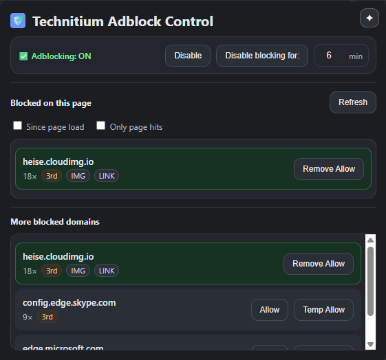
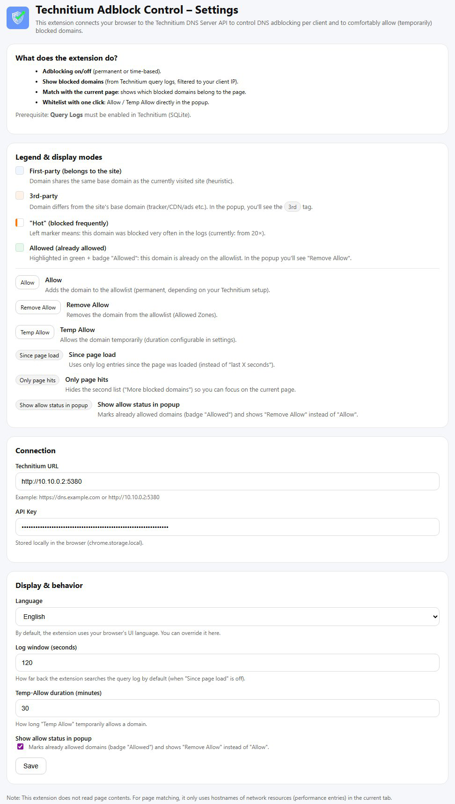

#  Technitium Adblock Control

Deutsch: [docs/README.de.md](docs/README.de.md)

> A powerful browser extension for Chrome & Vivaldi to directly control the blocking feature of the [Technitium DNS Server](https://technitium.com/dns/).

  

**Technitium Adblock Control (TAC)** connects your browser live with your Technitium DNS server. TAC lets you control adblocking globally, view logs in real time, and allow blocked domains in the context of the currently opened website — or remove an allow again.

---

## ✨ Features

* **⚡ Live status & control:** Toggle DNS blocking on/off with one click.
* **⏱️ Temporary disable:** Pause blocking for X minutes.
* **🎯 Context awareness:** Automatically detects which blocked domains belong to the *currently* opened website (subdomain matching between browser resources and DNS logs).
* **🔓 Granular allows:**
  * **Allow:** Permanently whitelist a domain.
  * **Temp Allow:** Allow a domain only for a defined time (e.g. 30 min).
* **🕵️‍♂️ Automatic client detection:** Automatically determines the browser’s correct IP address on your network to show only relevant logs (even with dynamic IPs).
* **🚀 Performance:** Caching for client IP & query-logger detection plus efficient background API calls (allow status optional via batch checks).

## 📸 Screenshots

| Popup Overview | Settings |
|:---:|:---:|
|  |  |

---

## 🛠️ Installation (Developer Mode)

Since the extension is not yet available in the Chrome Web Store, it must be installed manually:

1. Clone this repository or download it as a ZIP and extract it.
2. Open your browser (Chrome, Vivaldi, Edge, Brave).
3. Go to `chrome://extensions`.
4. Enable **Developer mode** (top right).
5. Click **“Load unpacked”**.
6. Select the folder that contains `manifest.json`.

## ⚙️ Configuration

After installation, the extension must be connected to your Technitium server:

1. Right-click the extension icon → **Options**.
2. **Base URL:** The URL of your Technitium web panel (e.g. `http://192.168.1.10:5380`).
3. **API Token:** Enter an API token from Technitium. Tip:
   * Open your Technitium web panel.
   * Navigate to `Settings` > `Web Service`.
   * Create a new token or user for the API.
4. Click **Save**.

---

## ✅ Requirements / Notes

* **Query logging must be enabled** (Query Logger DNS App).
* Your client must **use Technitium as DNS**, otherwise no matching log entries will appear.
* **DNS caching** may cause no new log hits to appear for a short time (if needed, hard-reload the page).

---

## 🧠 How it works (Technical Deep Dive)

This extension uses a few tricks to work around the limitations of a browser environment:

### 1. Getting the correct IP
Because a browser extension has no direct access to network infrastructure, it often doesn’t know which IP address it appears as to the DNS server (e.g. due to VPNs or NAT).

* **Solution:** The extension sends a background “fake request” to a unique domain (e.g. `ttip-12345.example.com`).
* It then immediately searches the DNS logs for that exact query.
* The client IP from that log entry is stored as the “own” IP and used for all further filtering.

### 2. Resource matching
To show what was blocked “on this page”, the extension uses the `performance.getEntriesByType("resource")` API.

* It compares the hostnames of all loaded resources in the current tab session with the DNS server’s `Blocked` log entries.
* Matching uses a subdomain rule (exact match or as subdomain) to reliably establish page context.

---

## 🏗️ Tech Stack

* **Manifest V3** service worker architecture
* **Vanilla JS**
* **Technitium DNS HTTP API**
* **Chrome Scripting & Storage API**

## 📝 License

This project is licensed under the **GNU General Public License v3.0 (GPLv3)**. See the `LICENSE` file for details.

---

**Disclaimer:** This is an unofficial project and is not affiliated with Technitium.
