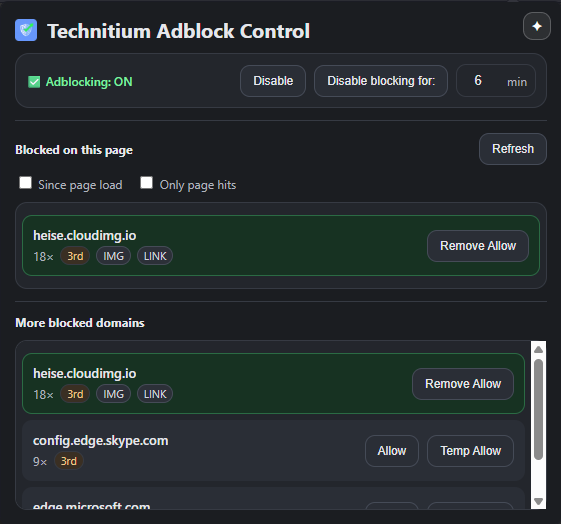
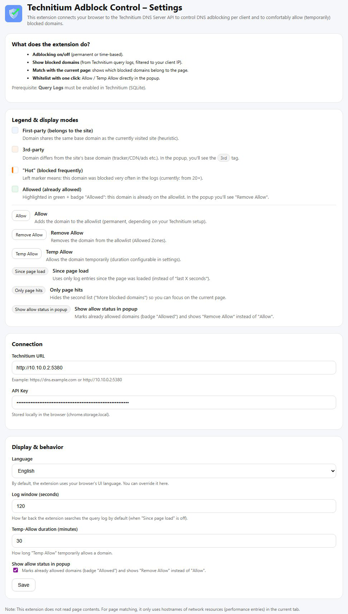

#  Technitium Adblock Control

Zur englischen README: [../README.md](../README.md)

> Eine leistungsstarke Browser-Extension für Chrome & Vivaldi zur Steuerung der Block-Funktion des [Technitium DNS Servers](https://technitium.com/dns/).

  

**Technitium Adblock Control (TAC)** verbindet deinen Browser live mit deinem Technitium DNS-Server. Du kannst DNS-Blocking global steuern, Query-Logs in Echtzeit einsehen und geblockte Domains kontextbezogen zur aktuell geöffneten Webseite freigeben (oder Freigaben wieder entfernen).

---

## ✨ Features

* **⚡ Live-Status & Steuerung:** DNS-Blocking mit einem Klick an/aus.
* **⏱️ Temporär deaktivieren:** Blocking für X Minuten pausieren (Timer).
* **🎯 Kontext-Awareness:** Zeigt, welche geblockten Domains zur *aktuell geöffneten* Seite gehören (Abgleich Browser-Ressourcen-Hosts ↔ Technitium Query Logs).
* **🏷️ Ressourcen-Typ Badges:** Zusätzliche Tags wie **IMG / JS / CSS / XHR / FONT / FRAME / MEDIA** zeigen, wofür eine Domain genutzt wird (abgeleitet aus `performance.getEntriesByType('resource')`).
* **🔓 Granulare Freigaben:**
  * **Allow:** Domain dauerhaft erlauben.
  * **Temp Allow:** Domain nur für eine definierte Zeit erlauben (z. B. 30 Minuten).
* **🕵️‍♂️ Automatische Client-Erkennung:** Ermittelt deine Client-IP per DNS-Log-Trick (funktioniert auch bei dynamischen IPs).
* **🌍 Mehrsprachige Oberfläche:** Nutzt standardmäßig die System-/Browsersprache (Deutsch/Englisch). In den Optionen kannst du die Sprache manuell umstellen.
* **🎨 Themes:** Standardmäßig folgt die Extension dem System-Theme. In den Optionen kannst du **Hell / Grau / Dunkel** erzwingen.

## 📸 Screenshots

| Popup Übersicht | Einstellungen |
|:---:|:---:|
|  |  |

---

## 🛠️ Installation (Entwicklermodus)

Zuerst, installiere Query Logs (Sqlite) aus dem Technitium Appstore. Klick auf Apps > Appstore und suche anch Query Logs (Sqlite). Klick install.

1. Klone dieses Repository oder lade es als ZIP herunter und entpacke es.
2. Öffne deinen Browser (Chrome, Vivaldi, Edge, Brave).
3. Gehe zu `chrome://extensions`.
4. Aktiviere oben rechts den **Entwicklermodus**.
5. Klicke auf **"Entpackte Erweiterung laden"**.
6. Wähle den Ordner aus, in dem die `manifest.json` liegt.

## ⚙️ Konfiguration

Nach der Installation muss die Extension mit deinem Technitium Server verbunden werden:

1. Rechtsklick auf das Extension-Icon → **Optionen**.
2. **Basis-URL:** URL deines Technitium Web-Panels (z. B. `http://192.168.1.10:5380`).
3. **API Token:**
   * Im Technitium Web-Panel: `Username` → `Create API Token`.
   * Token/User mit ausreichenden Rechten für Settings, Logs und Allowlist erstellen.
4. Speichern.

---

## ✅ Voraussetzungen / Hinweise

* **Query Logging muss aktiv sein** (Query Logger DNS App / SQLite Query Logs).
* Dein Client muss **Technitium als DNS** nutzen, sonst erscheinen keine passenden Log-Einträge.
* **DNS-Cache** kann „frische“ Log-Treffer reduzieren. Wenn das Popup leer wirkt, hilft oft ein Hard-Reload der Seite.

---

## 🧠 Wie es funktioniert (Technical Deep Dive)

### 1) Der „Magic IP“-Trick

Browser-Extensions wissen nicht immer, unter welcher Client-IP sie beim DNS-Server auftauchen (VPN/NAT/etc.).

* Die Extension triggert eine DNS-Auflösung für einen eindeutigen Hostnamen (z. B. `ttip-<timestamp>-<random>.example.com`).
* Anschließend sucht sie in den Technitium Query Logs nach genau diesem Eintrag.
* Die gefundene `clientIpAddress` wird gecacht und dient als Filter für **deine** Log-Einträge.

### 2) Resource Matching

Um „Geblockt auf dieser Seite“ zu bestimmen, liest TAC die Hostnames der geladenen Ressourcen über:

* `performance.getEntriesByType('resource')`

Diese Hostnames werden dann mit Domains aus den Technitium **Blocked**-Logeinträgen gematcht (exakt oder als Subdomain).

### 3) Ressourcen-Typ Badges

Jeder `PerformanceResourceTiming`-Eintrag enthält einen `initiatorType` (z. B. `img`, `script`, `css`, `xmlhttprequest`). TAC aggregiert diese pro Domain und zeigt kompakte Tags wie `IMG`, `JS`, `CSS`.

> Hinweis: Wenn eine Ressource so früh geblockt wird, dass der Browser keinen Timing-Eintrag erzeugt, kann für diese Domain ggf. kein Typ-Badge erscheinen.

## 🔒 Datenschutz & Sicherheit

**Welche Daten verarbeitet die Extension?**

- Die Extension liest im aktiven Tab nur **Hostnames von Netzwerk-Ressourcen** über die Web-Performance-API (`performance.getEntriesByType('resource')`).
- Inhalt der Webseite (DOM-Text, Formulare, Cookies etc.) wird **nicht** ausgelesen.
- Zusätzlich werden über die Technitium DNS HTTP API **Query-Logs** deines eigenen Technitium-Servers abgefragt, um geblockte Domains anzuzeigen.

**Wo werden Daten gespeichert?**

- Die Konfiguration (Basis-URL deines Technitium-Servers, API-Token, UI-Einstellungen, Timer-Status, Temp-Allow-Regeln) wird ausschließlich lokal in `chrome.storage.local` des Browsers gespeichert.
- Es werden **keine Daten** an Dritte oder fremde Server übertragen - nur an den von dir konfigurierten Technitium-DNS-Server.

**Berechtigungen & Zugriff auf Websites**

- Die Extension **benötigt Zugriff auf alle Websites, um die Hostnames geladener Ressourcen zu lesen und sie mit den DNS-Blocklogs deines Technitium-Servers abzugleichen. Es werden keine Seiteninhalte gelesen.**
- Der Zugriff wird ausschließlich dafür verwendet, um:
  - die aktuell geladenen Domains/Ressourcen mit den Technitium-Query-Logs abzugleichen („Geblockt auf dieser Seite“),
  - den Status von geblockten/erlaubten Domains im Kontext der geöffneten Seite anzuzeigen.

**Umgang mit API-Token**

- Der API-Token für den Technitium-Server wird nur lokal im Browser gespeichert und ausschließlich für Aufrufe zur Technitium DNS HTTP API verwendet.
- Empfohlen wird die Verwendung eines **dedizierten API-Tokens** mit auf das Nötigste beschränkten Rechten statt eines allgemeinen Admin-Tokens.

**Empfohlene Technitium-API-Berechtigungen**

| Bereich | Lesen / View | Schreiben / Modify | Löschen / Delete | Verwendet für |
|---|---:|---:|---:|---|
| **Settings** | Ja | Ja | Nein | Blocking-Status lesen, Blocking ein-/ausschalten, temporär deaktivieren |
| **Logs** | Ja | Nein | Nein | Geblockte Domains und Query-Logs lesen |
| **Apps** | Ja | Nein | Nein | Query Logs / Query Logger App über `/api/apps/list` erkennen |
| **Allowed** | Optional | Ja | Ja | Allow-Status prüfen, Allow setzen, Allow entfernen, Temp-Allow aufräumen |
| **Cache** | Nein | Nein | Ja | Cache-Einträge nach Allow/Remove löschen, damit Änderungen sofort greifen |

**Hinweise zum Least-Privilege-Setup**

- **Allowed: Lesen / View** ist nur erforderlich, wenn die Extension bereits erlaubte Domains erkennen und **Remove Allow** anzeigen soll.
- Wenn du die Allow-Status-Erkennung **nicht** benötigst, kannst du **Allowed: Lesen / View** weglassen und trotzdem Allow/Remove weiter nutzen.
- Rechte wie **Dashboard**, **Zones**, **Blocked**, **DnsClient**, **DhcpServer** oder **Administration** werden für diese Extension nicht benötigt.

---

## 🏗️ Tech Stack

* **Manifest V3** Service Worker Architektur
* **Vanilla JS**
* **Technitium DNS HTTP API**
* **Chrome Scripting & Storage API**

## 📝 Lizenz

Dieses Projekt ist unter der **GNU General Public License v3.0 (GPLv3)** lizenziert. Siehe `LICENSE` Datei für Details.

---

**Disclaimer:** Dies ist ein inoffizielles Projekt und steht in keiner Verbindung zu Technitium.
